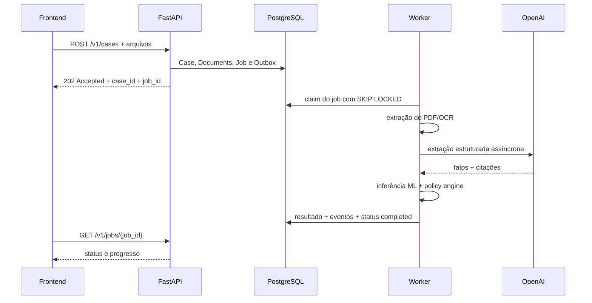
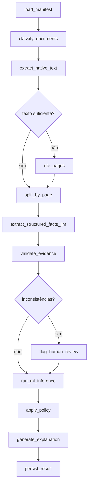
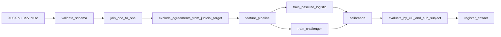
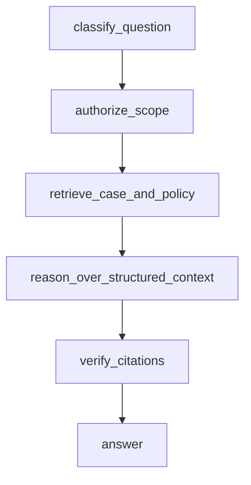
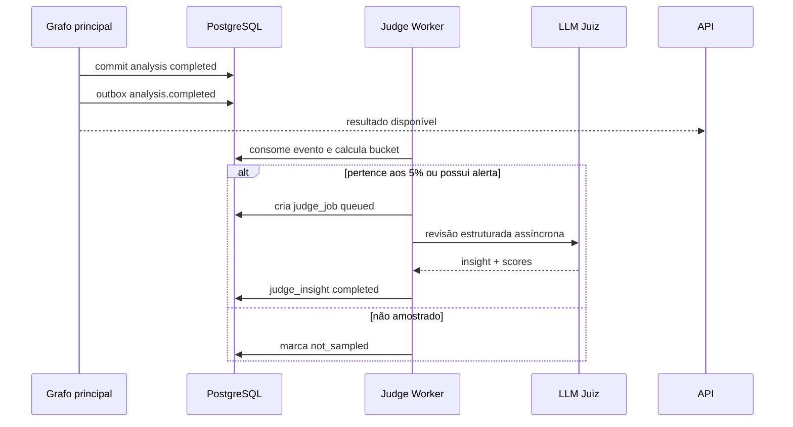

# Entregáveis técnicos e arquitetura assíncrona

## Objetivo

Este documento define os próximos entregáveis do backend para transformar o boilerplate atual em um sistema de análise jurídica com ingestão documental, ML, LangGraph, revisão amostral por LLM e observabilidade.

A prioridade arquitetural é manter o caminho da API curto e tornar todo processamento caro assíncrono, persistido e retomável.

## Estado atual

Já existe em `backend/`:

- FastAPI;
- PostgreSQL;
- SQLAlchemy assíncrono;
- Alembic;
- LangGraph;
- integração opcional com OpenAI;
- tabela `analyses` para input e resultado;
- fluxo demonstrativo:

```text
assess_evidence
  -> estimate_risk
  -> apply_policy
  -> price_agreement | prepare_defense
  -> explain_recommendation
```

O endpoint atual usa `analysis_graph.ainvoke`, mas ainda aguarda o grafo terminar antes de responder. Isso é assíncrono no sentido de não bloquear a thread durante I/O, porém ainda é síncrono do ponto de vista do cliente HTTP. O próximo passo é desacoplar requisição e execução com jobs persistidos.

## Prioridades

| Prioridade | Entregável | Resultado esperado |
|---:|---|---|
| P0 | Ingestão assíncrona de planilhas e PDFs | Upload retorna `202`; worker extrai texto, fatos e evidências |
| P0 | Treinamento e inferência de ML | Probabilidade calibrada de perda e faixa de condenação |
| P0 | Persistência e observabilidade do grafo | Execuções retomáveis, auditáveis e correlacionadas |
| P0 | Juiz LLM assíncrono em amostra de 5% | Insights de qualidade sem aumentar a latência da decisão |
| P1 | Chatbot de dúvidas | Consulta explicável e somente leitura sobre fluxo, política e casos |

---

## 1. LangGraph para planilhas e PDFs

### 1.1 Fontes disponíveis hoje

A base principal não está em CSV. Ela está atualmente na raiz do repositório:

```text
data/datasets/Hackaton_Enter_Base_Candidatos.xlsx
```

Ela possui duas abas:

- `Resultados dos processos`: 60.000 processos e 8 colunas;
- `Subsídios disponibilizados`: 60.000 processos e os 6 indicadores documentais.

A planilha `docs/Entregas Hackathon UFMG.xlsx` contém links de submissões do hackathon e **não é dado de treinamento**.

Os casos de demonstração estão em `data/cases/`:

```text
data/cases/Caso_01_0801234-56-2024-8-10-0001/
data/cases/Caso_02_0654321-09-2024-8-04-0001/
```

Cada pasta contém autos e subsídios em PDF. A primeira possui autos e os seis subsídios; a segunda possui autos, comprovante de crédito, demonstrativo da dívida e laudo referenciado.

### 1.2 Organização futura dos dados

Arquivos brutos não devem ser commitados. A estrutura local recomendada é:

```text
data/
├── raw/
│   ├── Hackaton_Enter_Base_Candidatos.xlsx
│   └── cases/
│       ├── 0801234-56-2024-8-10-0001/
│       └── 0654321-09-2024-8-04-0001/
├── processed/
│   ├── judicial_outcomes.parquet
│   ├── subsidy_flags.parquet
│   └── training_dataset.parquet
└── manifests/
    └── dataset_manifest.json
```

CSV deve ser aceito como formato de entrada adicional, mas o formato canônico processado deve ser Parquet. Parquet preserva tipos e evita problemas de encoding, separador decimal e inferência de schema encontrados em CSV.

### 1.3 Fluxo HTTP assíncrono

O upload não deve executar OCR, LLM ou ML dentro da requisição.



Contrato sugerido:

```text
POST /v1/cases                  -> 202 + case_id + ingestion_job_id
GET  /v1/jobs/{job_id}          -> queued | running | completed | failed
POST /v1/cases/{id}/analyses    -> 202 + analysis_job_id
GET  /v1/analyses/{analysis_id} -> análise persistida
```

### 1.4 Grafo documental proposto



Estado mínimo do grafo:

```python
class CaseAnalysisState(TypedDict, total=False):
    case_id: str
    job_id: str
    document_ids: list[str]
    extracted_pages: list[dict]
    facts: dict
    evidence: list[dict]
    inconsistencies: list[str]
    loss_probability: float
    condemnation_quantiles: dict[str, float]
    recommendation: str
    agreement_range: dict[str, float] | None
    policy_version: str
    model_version: str
    requires_human_review: bool
```

Não colocar bytes de PDF nem o texto completo no state. O state deve guardar IDs e resultados compactos; conteúdo bruto permanece no object storage ou banco documental.

### 1.5 Extração de PDF

Ordem recomendada:

1. classificar pelo nome do arquivo quando houver padrão confiável;
2. extrair texto nativo por página com PyMuPDF ou pdfplumber;
3. medir qualidade: caracteres por página, proporção alfanumérica e páginas vazias;
4. aplicar OCR apenas nas páginas abaixo do limiar;
5. preservar `document_id`, página e coordenadas quando disponíveis;
6. enviar ao LLM somente trechos necessários para cada campo;
7. exigir saída estruturada e citações literais.

O LLM deve extrair, não decidir:

```text
UF
número do processo
valor da causa
sub-assunto
valor e data do contrato
valor creditado
titularidade da conta
presença e resultado de validação de assinatura
sinais de fraude
inconsistências entre documentos
```

Cada fato precisa manter proveniência:

```json
{
  "field": "credited_amount",
  "value": 7200.0,
  "document_id": "...",
  "page": 2,
  "quote": "Crédito liberado no valor de R$ 7.200,00",
  "extractor": "llm",
  "confidence": 0.94
}
```

### 1.6 Separação entre CPU e I/O

Trabalho de CPU:

- OCR;
- renderização de páginas;
- parsing de PDFs grandes;
- transformação de datasets;
- treino de ML.

Esse trabalho deve rodar em processo de worker, nunca diretamente no event loop da API.

Trabalho de I/O:

- OpenAI;
- PostgreSQL;
- object storage;
- chamadas HTTP.

Esse trabalho deve usar clientes assíncronos e `await`.

`async` não acelera CPU. Ele evita manter uma thread bloqueada enquanto se espera rede ou banco.

---

## 2. Treinamento de ML

### 2.1 O que a base permite treinar

A base foi inspecionada com os seguintes resultados:

- 60.000 processos únicos;
- join exato entre resultados e subsídios;
- nenhum ID duplicado;
- nenhum campo ausente;
- 41.733 resultados de êxito;
- 18.267 resultados de não êxito;
- somente 280 acordos concluídos.

O modelo judicial deve excluir os 280 acordos, porque acordo não revela qual seria o resultado contrafactual da defesa.

Treinar dois modelos:

```text
Modelo 1: P(resultado adverso | caso)
Modelo 2: E(condenação | resultado adverso, caso), com quantis q10/q50/q90
```

Features iniciais:

- UF;
- sub-assunto;
- contrato;
- extrato;
- comprovante de crédito;
- dossiê;
- demonstrativo da dívida;
- laudo referenciado.

O classificador de risco não recebe valores monetários. O modelo de severidade recebe
`Valor da causa`, disponível no início, para estimar o valor efetivamente pago quando houver
resultado adverso. `Valor da condenação/indenização` é label histórica e nunca input de
nenhum modelo ou inferência.

Depois da ingestão dos PDFs, adicionar somente features documentais com proveniência e estabilidade demonstráveis.

### 2.2 O que a base não permite treinar

Não treinar probabilidade de aceite da oferta com a base atual. Há apenas acordos concluídos e faltam propostas recusadas, contrapropostas, sequência de ofertas e tempo até resposta.

Até coletar esses eventos, abertura, alvo e teto devem ser definidos pela política e pelo custo esperado, com análise de sensibilidade. Qualquer taxa de aceite deve ser rotulada como hipótese.

### 2.3 Pipeline de treino



Baseline obrigatório: regressão logística. Challenger: CatBoost ou XGBoost. O challenger só substitui o baseline se melhorar calibração e estabilidade, não apenas AUC.

Métricas:

- ROC-AUC e PR-AUC;
- Brier score;
- curva de calibração;
- recall em casos de alto custo;
- MAE dos valores;
- cobertura dos intervalos quantílicos;
- performance por UF e sub-assunto.

A planilha não contém data de sentença. Portanto, não é possível fazer validação temporal real; essa limitação deve aparecer na apresentação. Usar validação estratificada e manter um holdout intocado para a demo.

### 2.4 Artefato e versionamento

Todo modelo promovido precisa de:

```text
model_version
training_dataset_hash
feature_schema_version
training_code_revision
metrics
calibration_method
created_at
```

A análise persistida deve guardar `model_version` e `policy_version`. Nunca inferir com um artefato sem saber qual dataset e código o produziram.

---

## 3. Chatbot de dúvidas — posterior

O chatbot é P1. Ele não deve atrasar ingestão, política, ML ou monitoramento.

### Escopo

Responder dúvidas como:

- por que este caso recebeu recomendação de acordo?;
- quais documentos pesaram na decisão?;
- qual regra da política foi aplicada?;
- por que o valor alvo difere do teto?;
- o que falta para fortalecer a defesa?;
- como interpretar probabilidade e intervalo de condenação?.

### Fontes autorizadas

- política vigente e versões anteriores;
- resultado estruturado da análise;
- evidências e citações persistidas;
- documentação interna aprovada;
- glossário jurídico.

### Ferramentas de leitura

```text
get_case_analysis(case_id)
get_evidence(case_id, field)
get_policy_version(policy_version)
get_model_card(model_version)
explain_financial_calculation(analysis_id)
```

O chatbot será somente leitura. Não poderá modificar recomendação, valor, decisão do advogado ou resultado.

### Grafo sugerido



“Reasoning” significa executar um fluxo interno estruturado e verificar evidências. Não significa expor cadeia de pensamento privada. A resposta deve mostrar conclusão, cálculo reproduzível, regra aplicada e citações.

Sessões podem usar `thread_id` e checkpointer PostgreSQL para continuidade. Dados de um caso nunca podem aparecer em outra sessão ou para usuário sem autorização.

---

## 4. Observabilidade e persistência do grafo

### 4.1 Responsabilidades diferentes

PostgreSQL e LangSmith não são substitutos.

**PostgreSQL é fonte de verdade:**

- status do job;
- estado retomável;
- resultado jurídico;
- decisão do advogado;
- versão de política/modelo;
- juiz LLM e seus insights;
- erros operacionais relevantes.

**LangSmith é telemetria:**

- trace por execução e nó;
- latência;
- tokens e custo;
- prompt/modelo;
- erros de LLM;
- avaliações e feedback.

Se LangSmith estiver indisponível, a análise deve continuar e ser persistida no PostgreSQL.

### 4.2 Tabelas previstas

```text
cases
case_documents
case_evidence
analysis_jobs
analyses
graph_runs
judge_jobs
judge_insights
outbox_events
```

Campos mínimos de `analysis_jobs`:

```text
id
analysis_id
status: queued | running | completed | failed | dead_letter
attempt_count
available_at
claimed_at
claimed_by
last_error
created_at
updated_at
```

O worker deve buscar jobs com `SELECT ... FOR UPDATE SKIP LOCKED`. Isso permite múltiplos workers sem processar o mesmo job simultaneamente.

LangGraph pode ser compilado com checkpointer PostgreSQL. Cada execução usa:

```python
config = {
    "configurable": {"thread_id": str(analysis_id)},
    "tags": ["case-analysis", policy_version, model_version],
    "metadata": {
        "analysis_id": str(analysis_id),
        "policy_version": policy_version,
        "model_version": model_version,
    },
}

result = await graph.ainvoke(state, config=config)
```

`thread_id` correlaciona checkpoints e permite retomar uma execução. Não usar checkpointer em memória fora de testes.

### 4.3 LangSmith

Configuração prevista:

```env
LANGSMITH_TRACING=true
LANGSMITH_API_KEY=
LANGSMITH_PROJECT=enter-os
```

Metadados recomendados:

```text
analysis_id
case_id anonimizado
job_id
policy_version
model_version
node_name
judge_sample_cohort
```

Não enviar PDFs completos, CPF, conta, nome da parte ou texto bruto sensível como metadata/tag. Aplicar redaction antes do trace. Citações necessárias para debugging devem usar ambiente controlado e política de retenção explícita.

### 4.4 Métricas operacionais

- jobs em fila;
- idade do job mais antigo;
- tempo por nó;
- tempo total do grafo;
- taxa de falha por nó;
- retries e dead letters;
- latência e timeout do LLM;
- tokens e custo por análise;
- taxa de fallback determinístico;
- distribuição das recomendações;
- drift da probabilidade;
- cobertura da amostra do juiz.

Trace sampling e judge sampling são conceitos separados. Podemos traçar 100% durante o hackathon e executar o juiz somente em 5% dos casos.

---

## 5. Juiz LLM assíncrono em 5%

### 5.1 Objetivo

Após a conclusão da análise principal, um segundo LLM revisa uma amostra estável de 5% e produz insights de qualidade. O juiz não altera a recomendação e nunca bloqueia a resposta ao advogado.

Com aproximadamente 5.000 casos mensais do cenário, 5% representa cerca de 250 revisões por mês.

### 5.2 Dois fluxos separados

1. **Amostra imparcial de 5%:** usada para medir qualidade agregada.
2. **Revisão acionada por alerta:** baixa confiança, contradição, alto valor ou override. Esses casos não entram nas métricas da amostra imparcial.

Misturar os dois fluxos enviesaria a avaliação, pois alertas concentram casos difíceis.

### 5.3 Amostragem determinística

Não usar `random()` a cada retry. A decisão de amostrar deve ser estável e idempotente:

```python
import hashlib


def belongs_to_judge_sample(analysis_id: str, judge_version: str) -> bool:
    key = f"{analysis_id}:{judge_version}".encode()
    bucket = int.from_bytes(hashlib.sha256(key).digest()[:8], "big") % 100
    return bucket < 5
```

Persistir `sample_reason = random_5_percent | alert` e `judge_version`.

### 5.4 Fluxo assíncrono



O job do juiz é criado somente depois do commit da análise principal. Usar outbox evita perder o evento entre commit e publicação.

### 5.5 Concorrência assíncrona

O worker deve limitar concorrência. Criar uma task por job sem limite pode esgotar conexões, memória e rate limit.

Esboço:

```python
import asyncio
from openai import AsyncOpenAI

client = AsyncOpenAI(timeout=45.0, max_retries=2)
llm_slots = asyncio.Semaphore(8)


async def judge_one(job: JudgeJob) -> None:
    async with llm_slots:
        async with asyncio.timeout(50):
            response = await client.responses.parse(
                model=job.model,
                input=job.prompt,
                text_format=JudgeInsight,
            )
    await persist_insight(
        job_id=job.id,
        insight=response.output_parsed,
        provider_request_id=response._request_id,
    )


async def process_batch(jobs: list[JudgeJob]) -> None:
    async with asyncio.TaskGroup() as tasks:
        for job in jobs:
            tasks.create_task(judge_one(job))
```

Regras:

- `Semaphore` limita chamadas simultâneas ao provedor;
- `asyncio.timeout` limita duração total por tentativa;
- cada task abre sua própria `AsyncSession`; `AsyncSession` não deve ser compartilhada entre tasks concorrentes;
- persistir status antes e depois da chamada;
- retries somente para erros transitórios;
- erro permanente vai para `dead_letter` após o limite;
- shutdown deve parar de buscar jobs, aguardar tasks correntes e preservar jobs não concluídos;
- guardar `_request_id` do provedor para suporte e correlação.

Para 250 casos mensais, uma fila PostgreSQL e um worker assíncrono são suficientes. Não adicionar Redis, Celery ou Kafka até existir necessidade operacional comprovada.

### 5.6 Input do juiz

O juiz recebe contexto compacto:

- request estruturado;
- fatos extraídos;
- citações relevantes;
- output do ML;
- regras e overrides aplicados;
- recomendação e faixa;
- versão de política e modelo.

Não reenviar todos os PDFs. Isso aumenta custo, latência e exposição de dados sem necessidade.

### 5.7 Output estruturado

```python
class JudgeInsight(BaseModel):
    evidence_grounding_score: float
    policy_consistency_score: float
    explanation_quality_score: float
    missing_evidence: list[str]
    contradictions: list[str]
    insights: list[str]
    requires_human_review: bool
```

O juiz avalia:

- se cada afirmação possui evidência;
- se a política foi aplicada de forma consistente;
- se cálculo e limites são reproduzíveis;
- se a explicação omitiu um risco importante;
- se há contradições que exigem revisão humana.

Ele não pode escrever em `analyses.result_payload`. Insights ficam em `judge_insights` e são exibidos separadamente.

### 5.8 Métricas do juiz

- cobertura real da amostra, esperada em torno de 5%;
- cobertura por UF, sub-assunto e recomendação;
- tempo em fila e tempo de execução;
- falhas, retries e timeouts;
- custo e tokens;
- taxa de recomendação para revisão humana;
- score médio por versão da política/modelo;
- divergência entre juiz e feedback humano posterior.

---

## 6. Plano de implementação

### Entregável A — Ingestão

- criar `cases`, `case_documents`, `analysis_jobs` e `outbox_events`;
- upload com resposta `202`;
- storage local para demo, abstraído por interface;
- worker PostgreSQL com `SKIP LOCKED`;
- extração nativa e OCR seletivo;
- facts e evidências com página/citação.

**Pronto quando:** reiniciar API ou worker no meio de uma análise não perde o job, e os dois casos exemplo terminam com evidências persistidas.

### Entregável B — ML

- mover dados localmente para `data/raw`;
- validar e normalizar as duas abas;
- treinar baseline e challenger;
- calibrar probabilidade;
- treinar quantis de condenação;
- salvar artefato e model card;
- integrar inferência ao nó `run_ml_inference`.

**Pronto quando:** o mesmo artefato reproduz métricas registradas e toda análise grava `model_version`.

### Entregável C — Persistência e LangSmith

- adicionar checkpointer PostgreSQL;
- correlacionar `analysis_id`, `thread_id` e trace;
- adicionar tags e metadata sem PII;
- criar dashboard operacional mínimo;
- testar retomada após interrupção.

**Pronto quando:** uma execução interrompida pode ser retomada sem repetir nós concluídos e sem duplicar resultado.

### Entregável D — Juiz 5%

- amostragem determinística;
- outbox `analysis.completed`;
- worker assíncrono com semáforo e timeout;
- Structured Output;
- persistência de request ID, custo e insight;
- separação entre amostra aleatória e alertas.

**Pronto quando:** a análise principal mantém a mesma latência com juiz ligado ou desligado, e aproximadamente 5% dos casos elegíveis recebem insight persistido.

### Entregável E — Chatbot

- ferramentas somente leitura;
- recuperação de política, análise e evidências;
- verificação de autorização;
- respostas com regra, cálculo e citações;
- memória por `thread_id` no PostgreSQL.

**Pronto quando:** responde perguntas sobre um caso sem inventar fatos e sem acessar dados de outro caso.

## Decisões

1. API e workers permanecem em Python.
2. PostgreSQL será usado inicialmente como banco e fila persistida.
3. LLM não decide política nem preço.
4. OCR e treino não rodam no event loop.
5. Toda chamada LLM de background é limitada por semáforo e timeout.
6. Juiz de 5% não faz parte do caminho crítico.
7. LangSmith não substitui persistência de negócio.
8. Chatbot vem depois do ciclo principal estar fechado.

## Referências técnicas

- [LangGraph — pensar e estruturar grafos](https://docs.langchain.com/oss/python/langgraph/thinking-in-langgraph)
- [LangGraph — execução assíncrona e retomada](https://docs.langchain.com/oss/python/langgraph/functional-api)
- [LangGraph — interrupts](https://docs.langchain.com/oss/python/langgraph/interrupts)
- [LangSmith — tracing com LangGraph](https://docs.langchain.com/langsmith/trace-with-langgraph)
- [LangSmith — tags e metadata](https://docs.langchain.com/langsmith/trace-with-langchain)
- [OpenAI Python SDK — AsyncOpenAI, timeout e request ID](https://github.com/openai/openai-python/blob/main/README.md)
