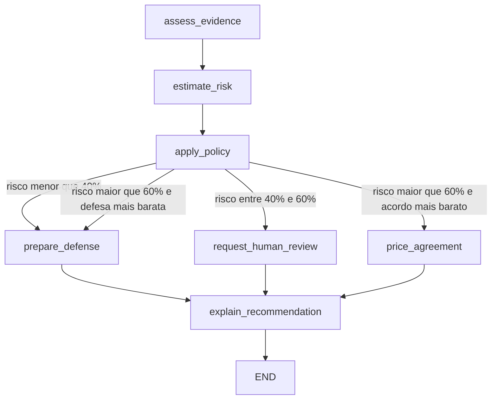
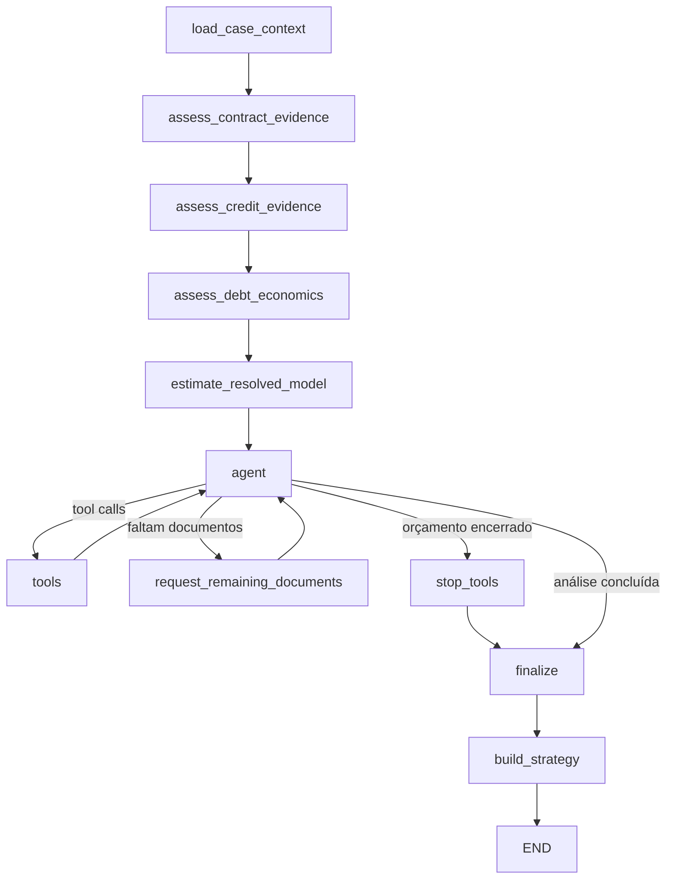

# Guia de visualização dos fluxos em tempo real

## Objetivo

Este guia mostra como acompanhar visualmente os dois fluxos LangGraph do backend:

1. **análise determinística**, que calcula evidência, risco e estratégia;
2. **revisão judicial documental**, que consulta os PDFs, chama ferramentas, usa o ML como apoio e produz uma decisão estruturada.

Há duas formas de visualização:

| Modo | Melhor uso | Situação no projeto |
|---|---|---|
| **LangSmith Traces** | acompanhar uma requisição real da API, chamadas de ferramentas, tempos, entradas, saídas e erros | já integrado |
| **LangSmith Studio** | executar manualmente um grafo e observar o diagrama interativo | exige configuração local opcional |

Para demonstrar os sete PDFs do caso 01, use primeiro o **LangSmith Traces**. Ele acompanha exatamente a execução feita por `POST /v1/judge/reviews`.

## Visão geral dos grafos

### Análise determinística



A política é determinística:

- risco `< 0.40`: defesa;
- risco `0.40–0.60`, incluindo os limites: revisão humana;
- risco `> 0.60`: comparação econômica entre acordo e defesa;
- custo esperado da defesa: `P(perda) × condenação esperada + R$ 1.500`;
- acordo somente quando o valor-alvo é estritamente menor que o custo esperado da defesa.

### Revisão judicial documental



O agente é limitado a 24 turnos. O grafo possui um limite de recursão maior para contabilizar os nós auxiliares e os retornos das ferramentas.

## Pré-requisitos

- Docker e Docker Compose; ou Python 3.12 com `uv`;
- conta e chave da OpenAI para executar a revisão judicial;
- conta e chave do LangSmith para enviar traces;
- os documentos dos casos em `data/cases/`;
- artefato `backend/artifacts/judicial-risk-v5.joblib`.

Nunca versione `backend/.env`. O arquivo já é privado e deve continuar ignorado pelo Git.

## Modo 1 — acompanhar uma requisição real no LangSmith

### 1. Criar o arquivo de ambiente

Na raiz do backend:

```bash
cd backend
cp .env.example .env
```

Preencha `backend/.env`:

```env
OPENAI_API_KEY=sua_chave_openai
OPENAI_MODEL=gpt-5.4-mini

LANGSMITH_TRACING=true
LANGSMITH_API_KEY=sua_chave_langsmith
LANGSMITH_PROJECT=enter-os-dev
LANGSMITH_ENDPOINT=https://api.smith.langchain.com
LANGSMITH_WORKSPACE_ID=
```

Use `LANGSMITH_WORKSPACE_ID` quando a chave puder acessar mais de um workspace. Para uma organização hospedada na região europeia, confirme a região antes de enviar qualquer dado e use o endpoint definido pela organização, por exemplo `https://eu.api.smith.langchain.com`.

O tracing somente fica ativo quando `LANGSMITH_TRACING=true` **e** `LANGSMITH_API_KEY` está preenchida.

### 2. Subir banco e API

```bash
docker compose up --build
```

Aguarde:

```text
Application startup complete.
Uvicorn running on http://0.0.0.0:8000
```

Em outro terminal, confirme:

```bash
curl http://localhost:8000/ready
```

O esperado é `200 OK`.

### 3. Confirmar os documentos disponíveis

```bash
curl http://localhost:8000/v1/documents
```

Os caminhos enviados ao juiz devem ser exatamente os valores de `documents[].path`. No Docker, `data/` é montado como `/data`; o mount é gravável para persistir PDFs recebidos em `data/uploads/`.

### 4. Abrir o projeto no LangSmith

Acesse:

```text
https://smith.langchain.com
```

Abra o projeto configurado em:

```text
enter-os-dev
```

Filtre as execuções por:

```text
judge-document-review
```

### 5. Disparar o caso 01

Use o Thunder Client conforme `TEST.md` ou execute:

```bash
curl -X POST http://localhost:8000/v1/judge/reviews \
  -H 'Content-Type: application/json' \
  -d '{
    "case_number": "0801234-56.2024.8.10.0001",
    "question": "Analise a existência da contratação, do crédito e da dívida e apresente uma decisão fundamentada.",
    "documents": [
      {"path": "cases/Caso_01_0801234-56-2024-8-10-0001/01_Autos_Processo_0801234-56-2024-8-10-0001.pdf", "document_type": "case_record"},
      {"path": "cases/Caso_01_0801234-56-2024-8-10-0001/02_Contrato_502348719.pdf", "document_type": "contract"},
      {"path": "cases/Caso_01_0801234-56-2024-8-10-0001/03_Extrato_Bancario.pdf", "document_type": "bank_statement"},
      {"path": "cases/Caso_01_0801234-56-2024-8-10-0001/04_Comprovante_de_Credito_BACEN.pdf", "document_type": "credit_proof"},
      {"path": "cases/Caso_01_0801234-56-2024-8-10-0001/05_Dossie_Veritas.pdf", "document_type": "dossier"},
      {"path": "cases/Caso_01_0801234-56-2024-8-10-0001/06_Demonstrativo_Evolucao_Divida.pdf", "document_type": "debt_evolution"},
      {"path": "cases/Caso_01_0801234-56-2024-8-10-0001/07_Laudo_Referenciado.pdf", "document_type": "referenced_report"}
    ],
    "new_case_data": {
      "state": "MA",
      "sub_subject": "generic",
      "claim_amount": 20000
    }
  }'
```

A requisição HTTP aguarda o grafo terminar. Durante esse período, os spans aparecem no projeto LangSmith conforme são enviados.

### 6. Correlacionar resposta e trace

A resposta contém:

```json
{
  "trace_id": "UUID da execução",
  "langsmith_project": "enter-os-dev",
  "tracing_enabled": true
}
```

O `trace_id` é definido como o próprio `run_id` do trace. Copie-o e procure esse UUID no LangSmith. Isso evita confundir duas revisões executadas ao mesmo tempo.

Os metadados do trace incluem somente:

- referência SHA-256 truncada do processo;
- quantidade de documentos;
- modelo utilizado;
- tags `judge-review` e ambiente.

O número bruto do processo não é enviado como metadata, embora possa aparecer no conteúdo do prompt e, portanto, no corpo do trace.

## Como ler o trace do caso 01

### Nós e documentos

| Ordem | Nó | PDFs pré-consultados | O que verificar |
|---:|---|---|---|
| 1 | `load_case_context` | `01_Autos_Processo_...pdf` | alegações, pedidos, controvérsia e valor da causa |
| 2 | `assess_contract_evidence` | `02_Contrato_502348719.pdf`; `05_Dossie_Veritas.pdf` | termos do contrato, assinatura e biometria |
| 3 | `assess_credit_evidence` | `03_Extrato_Bancario.pdf`; `04_Comprovante_de_Credito_BACEN.pdf` | crédito, conta, data e movimentação |
| 4 | `assess_debt_economics` | `06_Demonstrativo_Evolucao_Divida.pdf`; `07_Laudo_Referenciado.pdf` | parcelas, saldo, mora e consolidação das provas |

Cada leitura produz uma chamada `read_pdf_document` e uma mensagem de ferramenta. Os caminhos também aparecem na resposta em `document_node_reads`.

### Ciclo do agente

Após a pré-leitura, observe:

1. `estimate_resolved_model` recebe os inputs determinados pelo backend e calcula o ensemble;
2. `agent` recebe as mensagens, os retornos documentais e a inferência;
3. `tools` executa apenas leitura autorizada e `inspect_risk_model_card`;
4. o ciclo volta ao `agent` até todos os documentos terem sido consultados;
5. `finalize` exige um `JudgeDecision` estruturado;
6. `build_strategy` aplica a política determinística ao resultado do ML.

O tipo de cada documento determina os seis indicadores binários em processos novos. Quando a
planilha possui o processo, os indicadores das abas `Resultados dos processos` e `Subsídios
disponibilizados` são combinados com os documentos submetidos. O valor da causa alimenta apenas
a severidade e a política. Condenação observada, pagamento, resultado processual ou acordo
realizado não podem ser inputs do ML.

### Campos de auditoria da resposta

Verifique:

- `consulted_documents`: todos os documentos lidos com sucesso;
- `unreadable_documents`: documentos ausentes, inválidos ou com erro;
- `document_node_reads`: associação entre nó e PDF;
- `findings[].citations`: documentos e localizadores citados;
- `ml_analysis.inputs`: dados efetivamente enviados ao modelo e sua origem;
- `ml_analysis.inputs.claim_amount_usage`: deve ser `severity_only`;
- `ml_analysis.component_probabilities`: resultados de logistic regression e XGBoost;
- `ml_analysis.ensemble_weights`: deve mostrar 70% regressão logística e 30% XGBoost;
- `model_card_consulted`: deve ser `true` quando as limitações forem verificadas;
- `ml_tool_errors`: falhas de inferência sem fallback inventado;
- `strategy`: recomendação e cálculo determinístico;
- `strategy.human_review_reason`: motivo do bloqueio automático, quando aplicável.

`strategy` deve ser `null` quando não houver uma inferência ML válida.

## Modo 2 — visualizar o grafo interativamente no LangSmith Studio

O Studio é indicado para executar estados manualmente, inspecionar transições e observar o diagrama do grafo. O backend ainda não inclui a CLI nem `langgraph.json`; os passos abaixo são uma configuração opcional de desenvolvimento.

### 1. Instalar a CLI local

A partir de `backend/`:

```bash
uv add --dev "langgraph-cli[inmem]"
```

A CLI atual requer Python 3.11 ou superior; o projeto usa Python 3.12.

### 2. Criar `backend/langgraph.json`

```json
{
  "dependencies": ["."],
  "graphs": {
    "analysis": "./app/graph/workflow.py:analysis_graph"
  },
  "env": ".env"
}
```

Essa entrada expõe o grafo determinístico já compilado em `app.graph.workflow.analysis_graph`.

### 3. Iniciar o servidor de desenvolvimento

```bash
uv run langgraph dev
```

O servidor local usa normalmente a porta `2024`. Abra a URL mostrada pelo comando ou:

```text
https://smith.langchain.com/studio/?baseUrl=http://127.0.0.1:2024
```

No Safari ou em um ambiente que bloqueie a comunicação com `localhost`, use a opção `--tunnel` indicada pela documentação oficial:

```bash
uv run langgraph dev --tunnel
```

### 4. Executar o grafo de análise

Selecione `analysis` e use:

```json
{
  "request": {
    "case_number": "0801234-56.2024.8.10.0001",
    "state": "MA",
    "sub_subject": "generic",
    "claim_amount": 20000,
    "evidence": {
      "contract": true,
      "bank_statement": true,
      "credit_proof": true,
      "dossier": true,
      "debt_evolution": true,
      "referenced_report": true
    }
  }
}
```

O Studio mostrará o caminho executado entre `assess_evidence`, `estimate_risk`, `apply_policy`, o ramo escolhido e `explain_recommendation`.

### Limitação atual do juiz no Studio

O juiz documental não deve ser apontado diretamente para `build_judge_graph`, porque essa função exige dois modelos preparados e o serviço ainda injeta:

- `document_root` resolvido;
- lista normalizada de documentos autorizados;
- mensagem inicial;
- modelos com ferramentas e saída estruturada;
- run ID, tags e metadata.

Portanto:

- use **LangSmith Traces** para visualizar agora a execução completa dos PDFs pela API;
- exponha o juiz no Studio somente por meio de um adaptador que preserve essas validações e autorizações;
- não crie um atalho que permita ao Studio ler arquivos fora de `DOCUMENT_ROOT`.

## Visualização estática sem conta LangSmith

Para imprimir o diagrama Mermaid do grafo determinístico:

```bash
cd backend
uv run python -c 'from app.graph.workflow import analysis_graph; print(analysis_graph.get_graph().draw_mermaid())'
```

O resultado pode ser colado em um renderizador Mermaid. Essa opção mostra a topologia, mas não entradas, saídas, tempos ou execução em andamento.

## Roteiro de demonstração

1. Abra o projeto `enter-os-dev` no LangSmith.
2. Deixe a lista de traces visível e filtrada por `judge-document-review`.
3. Abra o Thunder Client com a requisição do caso 01.
4. Envie a requisição.
5. Abra o novo trace pelo `trace_id` retornado.
6. Expanda os quatro nós documentais.
7. Mostre que os sete PDFs aparecem em `document_node_reads`.
8. Expanda `estimate_resolved_model`: confirme `input_source`, os indicadores binários,
   `claim_amount_usage=severity_only` e as probabilidades de logistic regression e XGBoost.
9. Expanda `finalize` e depois `build_strategy`.
10. Compare `strategy` com os limiares determinísticos.
11. Termine lembrando que a saída é assistiva e exige revisão humana.

## Solução de problemas

### A aplicação não inicia

Confirme que `backend/.env` contém uma credencial válida:

```env
OPENAI_API_KEY=sua_chave_openai
```

O agente é obrigatório. Erros do provedor durante a execução retornam `502`, sem substituição
por uma explicação determinística.

### `tracing_enabled` retorna `false`

Confirme simultaneamente:

```env
LANGSMITH_TRACING=true
LANGSMITH_API_KEY=sua_chave_langsmith
```

Verifique também se o Compose foi iniciado dentro de `backend/`, onde o arquivo `.env` é carregado para interpolação.

### O trace não aparece no projeto esperado

Compare:

- `langsmith_project` na resposta HTTP;
- `LANGSMITH_PROJECT` no ambiente do processo;
- workspace associado à chave;
- `LANGSMITH_WORKSPACE_ID`, quando necessário;
- região configurada em `LANGSMITH_ENDPOINT`.

Procure pelo UUID de `trace_id`, não apenas pelo nome da execução.

### A API retorna `422`

Valide o JSON e confirme:

- duas chaves `}` no final quando houver um objeto `evidence` interno;
- ausência de vírgula depois do último campo;
- `claim_amount` numérico e positivo;
- `state` com duas letras;
- valores booleanos sem aspas.

### O catálogo não mostra os PDFs

No Docker, confira se `compose.yaml` mantém:

```yaml
volumes:
  - ../data:/data
```

Fora do Docker, `DOCUMENT_ROOT=../data` é interpretado a partir de `backend/`.

### O trace mostra documento não lido

Confira `unreadable_documents` e o retorno da respectiva ferramenta. O grafo não aceita citações para documentos que não tenham sido lidos com sucesso.

### O Studio não conecta em `127.0.0.1:2024`

Confirme que `uv run langgraph dev` continua em execução, use a URL impressa pela CLI e verifique se a porta `2024` está livre. No Safari, tente `--tunnel`.

### A revisão retorna `500`

Procure nos logs por `Judge document review failed` e correlacione com `trace_id`. Causas comuns:

- falha do provedor LLM;
- resposta estruturada inválida;
- documento ilegível;
- artefato ML ausente ou incompatível;
- citação para documento não consultado.

## Privacidade e segurança

O tracing automático pode incluir:

- prompts;
- respostas do LLM;
- argumentos e respostas das ferramentas;
- trechos extraídos dos PDFs;
- estado intermediário do grafo.

Até implementar redaction de inputs e outputs:

1. use somente os casos sintéticos fornecidos pelo hackathon;
2. não envie processos reais com nomes, CPF, conta ou outros dados pessoais;
3. confirme região, acesso, retenção e workspace antes de habilitar tracing;
4. mantenha API keys fora do Git e das imagens Docker;
5. trate LangSmith como telemetria, não como fonte de verdade jurídica;
6. registre a decisão humana no sistema autoritativo antes de usar a recomendação.

## Referências oficiais

- [LangGraph Studio](https://docs.langchain.com/oss/python/langgraph/studio)
- [Servidor LangGraph local](https://docs.langchain.com/oss/python/langgraph/local-server)
- [Estrutura de uma aplicação LangGraph](https://docs.langchain.com/oss/python/langgraph/application-structure)
- [LangSmith](https://smith.langchain.com)
