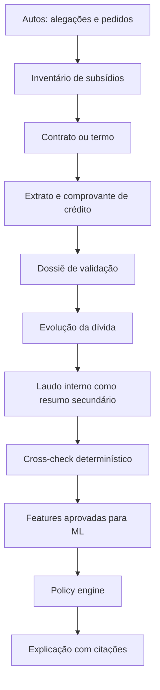

# Inventário de fontes, dados e documentos

## Objetivo

Este documento registra o conteúdo efetivamente encontrado nos slides, na base histórica e nos dois casos de demonstração. Ele também define quais fontes devem ser lidas pelo LLM, quais campos entram no modelo de ML e quais documentos servem apenas como contexto ou evidência secundária.

Os arquivos analisados são fictícios e foram fornecidos para o hackathon. Mesmo assim, o pipeline deve aplicar os mesmos controles de privacidade exigidos para dados reais.

## Escopo da inspeção

| Fonte | Conteúdo inspecionado |
|---|---:|
| `docs/Slides Unicamp.pdf` | 11 páginas |
| `data/datasets/Hackaton_Enter_Base_Candidatos.xlsx` | 2 abas e 120.000 registros lógicos, ligados 1:1 por processo |
| `data/cases/Caso_01_0801234-56-2024-8-10-0001/` | 7 PDFs, 20 páginas |
| `data/cases/Caso_02_0654321-09-2024-8-04-0001/` | 4 PDFs, 15 páginas |

Todos os PDFs fornecidos possuem camada de texto extraível. Não foi necessário OCR para esta inspeção. A implementação deve manter fallback de OCR porque documentos reais podem ser digitalizados como imagem.

Os arquivos fornecidos permanecem locais e não devem ser commitados.

---

## 1. Slides do desafio

Arquivo:

```text
docs/Slides Unicamp.pdf
```

### Conteúdo por página

| Página | Conteúdo | Uso no produto |
|---:|---|---|
| 1 | Hackathon Unicamp, prêmio de R$ 10.000 e contexto EnterOS | Contexto da apresentação; não entra em ML ou LLM de casos |
| 2 | Enter como empresa de Enterprise AI e EnterOS como operação jurídica centralizada | Contexto do fluxo operacional |
| 3 | Cerca de 15 mil processos novos/mês e 5 mil casos/mês de não reconhecimento de empréstimo | Dimensionamento, capacidade e observabilidade |
| 4 | Fluxo atual do advogado: recebe caso, consulta autos e subsídios, escolhe acordo/defesa, negocia e reporta | Define a jornada do usuário e os eventos que precisam ser persistidos |
| 5 | Missão: definir política, garantir implementação consistente e monitorar resultados | Define os três pilares do produto |
| 6 | Requisitos mínimos: regra de decisão, sugestão de valor, acesso à recomendação, aderência e efetividade | Critérios funcionais obrigatórios |
| 7 | Recursos: OpenAI, 60 mil resultados judiciais, flags de subsídios e dois processos exemplo | Define as fontes disponíveis |
| 8 | Descrição dos seis subsídios | Taxonomia inicial dos documentos |
| 9 | Entrega: GitHub, setup, vídeo de até 2 minutos e apresentação de até 15 minutos | Checklist da entrega |
| 10 | Avaliação: problema, criatividade/usabilidade, colaboração, execução e uso de IA | Critérios de priorização |
| 11 | Prazos de submissão e apresentação | Planejamento; não entra na solução |

### Requisitos derivados

A solução precisa produzir e registrar:

1. recomendação `acordo | defesa`;
2. valor sugerido quando houver acordo;
3. explicação acessível ao advogado;
4. decisão efetivamente tomada pelo advogado;
5. proposta, contraproposta e resultado da negociação;
6. resultado judicial ou acordo concluído;
7. métricas de aderência e efetividade;
8. versões da política e do modelo usadas em cada análise.

### Divergências encontradas nos slides

- A página 7 descreve a base como CSV, mas o arquivo fornecido é XLSX. A ingestão deve aceitar ambos e normalizar para Parquet.
- A página 7 fala em “sentenças judiciais”, mas a planilha contém resultados estruturados; não há texto integral das sentenças.
- A página 7 menciona dados dos últimos meses/12 meses, mas a planilha não possui data da distribuição, decisão ou trânsito. Não é possível validar temporalmente essa alegação nem fazer split temporal.
- A página 8 chama a instituição de “Banco BMG” na descrição do contrato, enquanto os casos exemplo usam “Banco UFMG”. O pipeline não deve usar esse nome do slide como dado do caso.

Os slides são fonte de requisitos, não fonte probatória e não entrada de inferência.

---

## 2. Base histórica

Arquivo:

```text
data/datasets/Hackaton_Enter_Base_Candidatos.xlsx
```

Os IDs dos casos 01 e 02 **não aparecem** nessa base. Os casos exemplo servem para inferência/demonstração; a planilha serve para treino e avaliação populacional.

### 2.1 Aba `Resultados dos processos`

Dimensão: 60.000 linhas × 8 colunas.

| Coluna | Tipo observado | Conteúdo | Papel no ML |
|---|---|---|---|
| `Número do processo` | string | Chave única no padrão CNJ | Chave de join; nunca feature |
| `UF` | categoria | 26 UFs presentes | Feature categórica e dimensão de monitoramento |
| `Assunto` | categoria | Sempre `Não reconhece operação` | Sem variância; remover da feature matrix atual |
| `Sub-assunto` | categoria | `Golpe` ou `Genérico` | Feature categórica |
| `Resultado macro` | categoria | `Êxito` ou `Não Êxito` | Target de classificação após regra para acordos |
| `Resultado micro` | categoria | Improcedência, extinção, parcial procedência, procedência ou acordo | Target detalhado/segmentação |
| `Valor da causa` | decimal | Valor pedido/atribuído antes do julgamento | Feature apenas do modelo de severidade e input da política determinística; excluído do risco |
| `Valor da condenação/indenização` | decimal | Valor efetivamente devido/pago após resultado adverso | Target do modelo de severidade; nunca feature ou input de inferência |

Qualidade observada:

- 60.000 números de processo únicos;
- zero duplicatas;
- zero campos ausentes;
- todas as UFs estão distribuídas quase uniformemente, exceto RR, que não aparece;
- valores monetários estão armazenados como `float`; a normalização deve converter para decimal ou centavos inteiros.

Distribuições:

| Campo | Valor | Quantidade | Percentual |
|---|---|---:|---:|
| Resultado macro | Êxito | 41.733 | 69,56% |
| Resultado macro | Não Êxito | 18.267 | 30,45% |
| Resultado micro | Improcedência | 27.935 | 46,56% |
| Resultado micro | Extinção | 13.798 | 23,00% |
| Resultado micro | Parcial procedência | 12.248 | 20,41% |
| Resultado micro | Procedência | 5.739 | 9,57% |
| Resultado micro | Acordo | 280 | 0,47% |
| Sub-assunto | Golpe | 41.628 | 69,38% |
| Sub-assunto | Genérico | 18.372 | 30,62% |

Valores:

| Métrica | Valor da causa | Condenação/indenização |
|---|---:|---:|
| Mínimo | R$ 1.000,00 | R$ 0,00 |
| Mediana | R$ 14.992,93 | R$ 0,00 |
| Média | R$ 14.982,19 | R$ 3.216,38 |
| Percentil 90 | R$ 21.392,81 | R$ 12.457,70 |
| Máximo | R$ 30.979,20 | R$ 28.414,68 |

Os 280 acordos estão classificados como `Não Êxito` no macro. Para estimar risco judicial, eles devem ser removidos: acordo não informa qual seria o resultado contrafactual da sentença.

### 2.2 Aba `Subsídios disponibilizados`

Dimensão lógica: 60.000 linhas × 7 colunas.

A primeira linha física contém a legenda `1 = Subsídio foi fornecido` e `0 = Subsídio não foi fornecido`. O cabeçalho real está na segunda linha. A ingestão deve ler essa aba com `header=1` ou localizar o cabeçalho de forma validada.

| Coluna | Conteúdo | Valores |
|---|---|---|
| `Número do processos` | Chave de join; o nome contém erro gramatical no arquivo | 60.000 IDs únicos |
| `Contrato` | Presença do contrato | 0 ou 1 |
| `Extrato` | Presença de extrato bancário | 0 ou 1 |
| `Comprovante de crédito` | Presença do comprovante | 0 ou 1 |
| `Dossiê` | Presença do dossiê de validação | 0 ou 1 |
| `Demonstrativo de evolução da dívida` | Presença da evolução das parcelas | 0 ou 1 |
| `Laudo referenciado` | Presença do laudo interno | 0 ou 1 |

Disponibilidade:

| Documento | Presente | Percentual |
|---|---:|---:|
| Contrato | 42.983 | 71,64% |
| Extrato | 48.895 | 81,49% |
| Comprovante de crédito | 36.414 | 60,69% |
| Dossiê | 41.986 | 69,98% |
| Demonstrativo de evolução da dívida | 46.215 | 77,03% |
| Laudo referenciado | 48.059 | 80,10% |

As duas abas têm o mesmo conjunto de 60.000 IDs e join 1:1 exato.

### 2.3 Relação entre documento e resultado

| Documento | Não Êxito sem documento | Não Êxito com documento |
|---|---:|---:|
| Contrato | 75,31% | 12,68% |
| Extrato | 81,69% | 18,81% |
| Comprovante de crédito | 46,74% | 19,89% |
| Dossiê | 30,43% | 30,45% |
| Demonstrativo de evolução da dívida | 39,44% | 27,76% |
| Laudo referenciado | 30,29% | 30,48% |

Contrato e extrato têm associação muito forte com o target. Isso torna essas flags úteis para um baseline, mas também exige controle contra leakage e viés de seleção. A base pode ter sido simulada com dependência direta entre presença documental e resultado. Associação não prova causalidade.

Dossiê e laudo, isoladamente, praticamente não separam os resultados nessa base. O conteúdo desses documentos pode ser útil para o LLM, mas a flag de presença não deve ganhar importância artificial no ML.

### 2.4 Uso correto no ML

Treino de classificação:

```text
features:
  UF
  Sub-assunto
  Contrato
  Extrato
  Comprovante de crédito
  Dossiê
  Demonstrativo de evolução da dívida
  Laudo referenciado

target:
  Resultado macro, excluindo Resultado micro = Acordo
```

Treino de valor:

```text
features:
  UF, Sub-assunto, Valor da causa e os seis indicadores documentais

target:
  Valor da condenação/indenização

filtro:
  Resultado micro em {Parcial procedência, Procedência}
```

Nunca usar como feature ou input de inferência:

- número do processo;
- resultado macro/micro;
- valor pago, valor da condenação ou indenização;
- qualquer informação produzida depois da decisão;
- output do LLM que contenha a recomendação desejada.

`Valor da causa` é conhecido no início e entra apenas no modelo que estima o valor
efetivamente pago. `Valor da condenação/indenização` aparece somente como label histórica
desse modelo. O valor pós-resultado não entra no classificador, nos regressores como feature
nem nas ferramentas de inferência.

---

## 3. Caso 01

Pasta:

```text
data/cases/Caso_01_0801234-56-2024-8-10-0001/
```

Processo normalizado: `0801234-56.2024.8.10.0001`.

Resumo extraído:

- comarca de São Luís/MA;
- alegação de não reconhecimento de empréstimo consignado;
- contrato nº `502348719`;
- valor da causa: R$ 20.000,00;
- dano moral pedido: R$ 15.000,00;
- empréstimo: R$ 5.000,00;
- 72 parcelas de R$ 120,00;
- contratação indicada em 10/05/2022;
- crédito indicado em 12/05/2022;
- seis tipos de subsídio presentes.

### 3.1 `01_Autos_Processo_0801234-56-2024-8-10-0001.pdf`

8 páginas.

Contém:

- petição inicial de ação declaratória de inexistência de débito;
- qualificação da parte autora e do banco;
- alegação de que nunca houve contratação;
- relato de descontos de R$ 120,00 desde junho de 2022;
- afirmação de que não houve depósito ou movimentação compatível;
- fundamentos de CDC, inversão do ônus da prova, repetição em dobro e dano moral;
- pedido de suspensão dos descontos;
- pedido de dano moral de R$ 15.000,00;
- valor da causa de R$ 20.000,00;
- procuração;
- cópia de identidade;
- comprovante de residência.

O que o LLM deve extrair:

```text
process_number
court
state
claim_type
alleged_fraud_type
contract_number
monthly_discount
alleged_start_date
claimed_moral_damages
case_value
requested_relief
plaintiff_assertions
attachments
```

Os fatos narrados pela parte são **alegações**, não fatos comprovados. Persistir com `source_role = plaintiff_assertion`.

### 3.2 `02_Contrato_502348719.pdf`

2 páginas.

Contém:

- cédula de crédito bancário;
- identificação do tomador e benefício;
- valor líquido de R$ 5.000,00;
- IOF de R$ 186,25 e seguro de R$ 87,50;
- 72 parcelas de R$ 120,00;
- taxas mensal/anual e CET;
- período de 10/06/2022 a 10/05/2028;
- desconto em benefício INSS;
- conta indicada para crédito;
- canal de correspondente bancário/telemarketing;
- cláusulas contratuais;
- campos de assinatura manual.

O que o LLM deve extrair:

```text
contract_number
borrower_identity_hash
contract_date
channel
principal
fees
installment_count
installment_amount
interest_rates
cet
first_due_date
last_due_date
credit_account
signature_type
```

Validações determinísticas:

- `72 × R$ 120,00 = R$ 8.640,00`, consistente com o total declarado;
- valor total financiado repete R$ 5.000,00 apesar de IOF e seguro listados, o que exige revisão;
- a tabela de evolução termina com saldo positivo, embora o contrato declare 72 parcelas até o fim. A inconsistência matemática precisa ser sinalizada.

### 3.3 `03_Extrato_Bancario.pdf`

1 página.

Contém:

- extrato da conta indicada no contrato;
- período de maio de 2022;
- crédito de R$ 5.000,00 em 12/05/2022 identificado pelo contrato;
- TED de R$ 3.000,00 no dia seguinte;
- PIX de R$ 1.500,00;
- saque de R$ 485,00;
- tarifas que levam o saldo a zero.

É a principal evidência material de liberação e movimentação do Caso 01. Contradiz diretamente a alegação dos autos de inexistência de movimentação compatível.

O LLM deve comparar titular, conta, data, valor e contrato. As transações posteriores não provam, sozinhas, quem operou a conta.

### 3.4 `04_Comprovante_de_Credito_BACEN.pdf`

2 páginas.

Contém declaração emitida pelo próprio Banco UFMG com:

- identificação do banco e do tomador;
- contrato, modalidade, data e valor;
- parcelas, juros, CET e canal;
- conta de destino e data de liberação;
- declaração de formalização e crédito.

Apesar do nome, o arquivo apresentado é uma declaração do banco, não um extrato independente obtido diretamente do BACEN. Classificar como `bank_issued_declaration`, não como confirmação externa autônoma.

### 3.5 `05_Dossie_Veritas.pdf`

2 páginas.

Contém relatório de terceiro sobre:

- assinatura manuscrita;
- documento de identidade;
- comprovante de residência;
- selfie/liveness;
- metodologia automatizada e análise manual;
- assinatura compatível em 91%;
- RG e endereço considerados válidos;
- match facial de 97,3%;
- parecer final de conformidade.

É a evidência independente mais forte sobre autoria no Caso 01. O LLM deve preservar scores e conclusão, sem converter automaticamente “compatível” em certeza de autoria.

### 3.6 `06_Demonstrativo_Evolucao_Divida.pdf`

3 páginas.

Contém:

- cronograma de 72 parcelas;
- saldo anterior, juros, amortização, parcela, saldo final e status;
- 21 parcelas marcadas como pagas;
- parcelas restantes em aberto;
- resumo com saldo residual aproximado de R$ 1.037,66 após a parcela 72.

Serve para calcular descontos efetivamente registrados e saldo, mas é documento interno e não prova autoria da contratação.

A existência de saldo positivo após a última parcela é incompatível com uma amortização integral em 72 pagamentos. O validador financeiro deve registrar essa inconsistência.

### 3.7 `07_Laudo_Referenciado.pdf`

2 páginas.

Contém resumo interno do banco:

- contrato e condições;
- partes;
- canal telemarketing;
- menção a gravação de voz de 7m42s;
- menção a termo com assinatura e documentos pessoais;
- autorização de consignação com ACK;
- confirmação do crédito na conta;
- afirmação de regularidade dos descontos.

O MP3, o ACK e os registros originais mencionados não foram fornecidos. O LLM deve marcá-los como `mentioned_not_attached`, nunca como evidência diretamente verificada.

O laudo resume outros documentos. Não pode ser contado como seis evidências novas; isso duplicaria peso probatório.

### 3.8 Vetor de inferência do Caso 01

Campos observáveis para o modelo histórico:

```yaml
UF: MA
Assunto: Não reconhece operação
Sub-assunto: Genérico  # classificação sugerida; deve passar pela taxonomia validada
Valor da causa: 20000.00
Contrato: 1
Extrato: 1
Comprovante de crédito: 1
Dossiê: 1
Demonstrativo de evolução da dívida: 1
Laudo referenciado: 1
```

O modelo recebe somente esse vetor e features documentais aprovadas. O LLM consulta os PDFs para extrair os campos; ele não escolhe o target nem altera a probabilidade.

### 3.9 Síntese documental do Caso 01

Pontos favoráveis à defesa documental:

- contrato presente;
- crédito exato em conta coincidente;
- movimentações posteriores;
- validação externa de assinatura e liveness;
- consistência de contrato, extrato e comprovante quanto a valor/data;
- histórico de parcelas pagas.

Pontos que exigem explicação ou revisão:

- autora nega contratação e movimentação;
- canal telemarketing combinado com assinatura manual e liveness precisa de narrativa operacional coerente;
- gravação, ACK e artefatos originais são mencionados, mas não anexados;
- valor financiado, IOF/seguro e cronograma não fecham integralmente;
- documentos de suporte são fictícios e parte deles é produzida pelo próprio banco.

---

## 4. Caso 02

Pasta:

```text
data/cases/Caso_02_0654321-09-2024-8-04-0001/
```

Processo normalizado: `0654321-09.2024.8.04.0001`.

Resumo extraído:

- comarca de Manaus/AM;
- alegação expressa de fraude por terceiro;
- contrato nº `603827451`;
- valor da causa: R$ 25.000,00;
- dano moral pedido: R$ 18.000,00;
- empréstimo: R$ 8.500,00;
- 84 parcelas de R$ 180,00;
- contratação indicada em 18/07/2023;
- crédito indicado em 19/07/2023;
- três dos seis tipos de subsídio ausentes.

### 4.1 `01_Autos_Processo_0654321-09-2024-8-04-0001.pdf`

8 páginas.

Contém:

- petição inicial de inexistência de débito e dano moral;
- alegação de fraude por terceiro;
- descontos mensais de R$ 180,00 desde agosto de 2023;
- afirmação de que o autor não usa o aplicativo e não possui smartphone compatível;
- afirmação de que não possui a conta Caixa indicada para o crédito;
- informação de que o benefício é recebido no Bradesco;
- menção a boletim de ocorrência e reclamação no BACEN;
- fundamentos de responsabilidade objetiva por fraude bancária;
- pedido de suspensão, repetição em dobro e dano moral de R$ 18.000,00;
- valor da causa de R$ 25.000,00;
- procuração, identidade e comprovante de residência.

O boletim de ocorrência e a reclamação são mencionados, mas não aparecem como arquivos separados na pasta. Marcar como `mentioned_not_attached`.

### 4.2 `02_Comprovante_de_Credito_BACEN.pdf`

2 páginas.

Contém declaração do banco com:

- contrato nº `603827451`;
- valor de R$ 8.500,00;
- 84 parcelas de R$ 180,00;
- canal digital/mobile;
- conta de destino na Caixa;
- data de crédito em 19/07/2023;
- declaração de que a conta pertence ao tomador.

Essa declaração contradiz a alegação do autor, mas não há extrato da Caixa nem comprovante independente de titularidade na pasta. Não tratar a declaração unilateral como prova conclusiva.

### 4.3 `03_Demonstrativo_Evolucao_Divida.pdf`

3 páginas.

Contém:

- cronograma de 84 parcelas;
- 8 parcelas marcadas como pagas;
- demais parcelas em aberto;
- saldo residual aproximado de R$ 2.748,38 após a parcela 84.

Registra descontos, mas não prova autoria nem recebimento do crédito. O saldo positivo depois da última parcela também exige validação financeira.

### 4.4 `04_Laudo_Referenciado.pdf`

2 páginas.

Contém resumo interno com:

- contratação pelo aplicativo mobile;
- device fingerprint;
- geolocalização e IP mascarado;
- alegação de autenticação por biometria facial e senha;
- aceite eletrônico;
- liberação na conta Caixa;
- informação crítica de que o vídeo de liveness não foi localizado;
- ausência de verificação grafotécnica externa.

Os logs brutos, termo de aceite, device fingerprint verificável, trilha de autenticação e comprovante de titularidade não foram anexados. O laudo apenas afirma sua existência.

A ausência do vídeo de liveness deve produzir `requires_human_review = true` ou alerta equivalente, conforme a política.

### 4.5 Documentos ausentes no Caso 02

| Tipo esperado | Status | Consequência |
|---|---|---|
| Contrato/termo de aceite | Ausente | Não é possível verificar o instrumento e o aceite diretamente |
| Extrato da conta de crédito | Ausente | Não é possível confirmar depósito e movimentação em fonte primária |
| Dossiê externo | Ausente | Não há validação independente de identidade/autoria |
| Vídeo de liveness | Mencionado, não localizado | Evidência de autenticação incompleta |
| Logs brutos do aplicativo | Mencionados, não anexados | Device/IP/geolocalização não são verificáveis no material fornecido |
| Boletim de ocorrência | Mencionado, não anexado separadamente | Alegação consta dos autos, sem documento isolado para conferência |

### 4.6 Vetor de inferência do Caso 02

```yaml
UF: AM
Assunto: Não reconhece operação
Sub-assunto: Golpe  # alegação explícita de contratação por terceiro
Valor da causa: 25000.00
Contrato: 0
Extrato: 0
Comprovante de crédito: 1
Dossiê: 0
Demonstrativo de evolução da dívida: 1
Laudo referenciado: 1
```

### 4.7 Síntese documental do Caso 02

Pontos favoráveis à defesa documental:

- declaração bancária de crédito;
- dados de canal, dispositivo, IP e geolocalização resumidos no laudo;
- oito parcelas registradas como pagas.

Pontos de risco:

- contrato/termo não anexado;
- extrato da conta de destino ausente;
- autor nega ser titular da conta Caixa;
- vídeo de liveness não localizado;
- não há dossiê independente;
- logs de aplicativo são mencionados, mas não apresentados;
- cronograma não termina com saldo zero;
- alegação explícita de fraude e boletim de ocorrência.

O Caso 02 tem lacunas materiais maiores que o Caso 01 e precisa de revisão humana antes de tratar as afirmações do laudo como fatos.

---

## 5. Comparação dos casos

| Evidência | Caso 01 | Caso 02 |
|---|---|---|
| Autos | Presente | Presente |
| Contrato/termo | Presente | Ausente |
| Extrato da conta creditada | Presente | Ausente |
| Comprovante de crédito | Presente | Presente |
| Dossiê externo | Presente | Ausente |
| Evolução da dívida | Presente | Presente |
| Laudo interno | Presente | Presente |
| Liveness original | Mencionado, não anexado | Declarado como não localizado |
| Alegação principal | Não contratou | Fraude por terceiro e conta de terceiro |
| Evidência cruzada de depósito | Contrato + extrato + comprovante | Apenas declaração e laudo do banco |
| Validação independente de autoria | Dossiê Veritas | Nenhuma |
| Inconsistência financeira | Saldo após parcela 72 | Saldo após parcela 84 |

---

## 6. Quais fontes cada componente consulta

### 6.1 Matriz de consumo

| Fonte | Extrator LLM | Validador determinístico | Modelo de ML | Policy engine | Explicação LLM |
|---|---:|---:|---:|---:|---:|
| Slides | Não | Não | Não | Requisitos implementados em configuração, não o PDF | Não |
| Base histórica — resultados | Não | Validação de dataset | Treino/eval | Não | Não |
| Base histórica — flags | Não | Validação de dataset | Treino/eval | Não | Não |
| Autos | Sim | Datas, valores e IDs | Somente features estruturadas aprovadas | Sim | Citações selecionadas |
| Contrato | Sim | Cálculo de parcelas, datas, IDs e consistência | Flag + features treinadas | Sim | Citações selecionadas |
| Extrato | Sim | Match de titular/conta/data/valor | Flag + matches derivados treinados | Sim | Citações selecionadas |
| Comprovante de crédito | Sim | Match de contrato/data/valor/conta | Flag + features treinadas | Sim | Citações selecionadas |
| Dossiê | Sim | Limites dos scores e identidade | Flag + scores apenas após treino apropriado | Sim | Citações selecionadas |
| Evolução da dívida | Sim | Soma, quantidade paga e saldo | Flag + features treinadas | Sim | Citações selecionadas |
| Laudo referenciado | Sim | Cross-check contra fontes primárias | Flag; evitar features duplicadas | Sim | Citações selecionadas |

### 6.2 Ordem de leitura do LLM



Cada tipo deve ter seu próprio schema de extração. Um prompt único para todos os PDFs tende a misturar alegação com prova e a duplicar fatos resumidos pelo laudo.

### 6.3 Hierarquia de evidência

| Nível | Fonte | Regra |
|---:|---|---|
| 1 | Artefato primário anexado: contrato, extrato, termo, log, áudio, vídeo | Pode sustentar fato após validação de identidade e integridade |
| 2 | Evidência independente: dossiê/perícia de terceiro | Sustenta avaliação técnica, preservando score e limitações |
| 3 | Documento interno: comprovante do banco, evolução, laudo | Corrobora; não substitui artefato primário ausente |
| 4 | Petição/autos | Registra alegações, pedidos e contexto; não transforma alegação em fato |
| 5 | Menção sem anexo | Apenas lacuna/pendência; nunca evidência confirmada |

O laudo referenciado não pode elevar artificialmente a confiança repetindo contrato, crédito e autenticação. Registrar relação `derived_from` entre fatos resumidos e documentos primários.

---

## 7. Contrato de dados entre LLM, ML e política

### Saída do extrator LLM

```json
{
  "field": "credit_amount",
  "value": 5000.0,
  "source_document_id": "...",
  "source_type": "bank_statement",
  "source_role": "primary_evidence",
  "page": 1,
  "quote": "CRÉDITO - EMPRÉSTIMO CONSIGNADO ... +5.000,00",
  "confidence": 0.98,
  "verification_status": "extracted"
}
```

Estados de verificação:

```text
extracted
cross_checked
contradicted
mentioned_not_attached
missing
invalid
```

### Feature builder determinístico

O feature builder, não o LLM, converte evidências em features:

```text
document_present.contract
credit_amount_matches_contract
credit_date_matches_contract
destination_account_matches_contract
account_ownership_verified
signature_validation_score
liveness_available
paid_installments
financial_schedule_balances
missing_critical_evidence_count
```

Uma feature nova só entra no modelo depois de existir no dataset histórico de treino. Até lá, ela pode participar da política como regra auditável, mas não deve ser enviada a um modelo que nunca foi treinado com esse campo.

### Saída do ML

```text
loss_probability
loss_probability_calibrated
condemnation_q10
condemnation_q50
condemnation_q90
model_version
feature_schema_version
```

### Saída da política

```text
recommendation
opening_offer
target_offer
maximum_offer
rules_applied
human_review_required
policy_version
```

O LLM final explica esses campos. Ele não recalcula probabilidade, condenação ou limites.

---

## 8. Regras obrigatórias de implementação

1. Normalizar o número CNJ sem depender do nome da pasta.
2. Detectar tipo documental pelo conteúdo; nome do arquivo é apenas sinal auxiliar.
3. Tratar petições como alegações e documentos bancários internos como fontes interessadas.
4. Preservar página e citação de todo fato extraído.
5. Separar `ausente` de `mencionado, mas não anexado`.
6. Não contar laudo e documento primário como evidências independentes do mesmo fato.
7. Fazer todos os cálculos financeiros em código determinístico.
8. Não enviar texto bruto de documentos para o modelo de ML.
9. Não usar outputs pós-decisão como features.
10. Persistir versão de extractor, prompt, modelo de ML e política.
11. Exigir revisão humana para contradição material, falta de evidência crítica ou autenticação incompleta.
12. Redigir PII antes de traces externos; IDs internos devem substituir nome, CPF e conta.

## Conclusão

A base histórica é apropriada para um baseline supervisionado de risco e valor, com cautela especial para leakage das flags documentais. Os PDFs servem para extração de fatos e validação de evidências por LLM, mas apenas features estruturadas e treinadas devem chegar ao ML.

O Caso 01 possui os seis subsídios e permite amplo cross-check entre contrato, crédito, extrato e validação externa. O Caso 02 possui somente comprovante, evolução e laudo, além de lacunas críticas em contrato, extrato, dossiê e liveness. Essa diferença é precisamente o tipo de informação que o fluxo deve transformar em evidência auditável, alerta de revisão e input controlado para a política.
